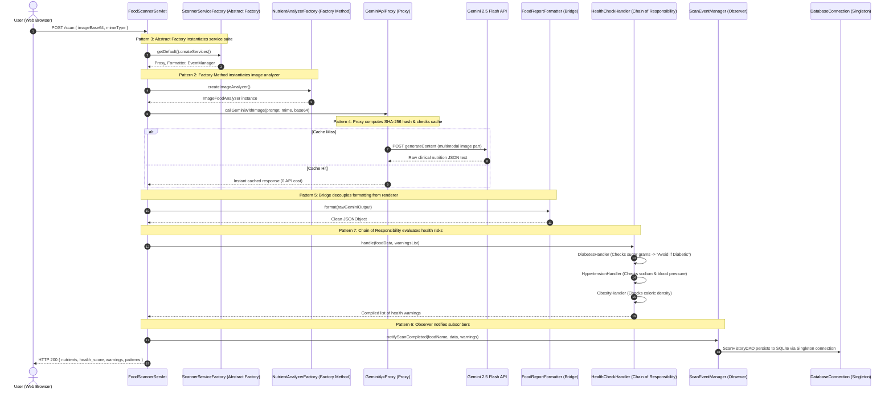

# 🥗 FoodScan Vision AI — Multimodal Food Scanner & Health Analysis

> An enterprise-grade Java web application engineered with **7 Software Design Patterns**, **Google Gemini 2.5 Flash Multimodal Vision API**, and **SQLite JDBC Database Connectivity**. Users upload an image of any food or meal to receive instant nutrient quantification, circular health scoring, and clinical condition risk assessments (including automated diabetes & sugar avoidance warnings).

---

## 📑 Table of Contents

1. [Architectural Overview](#-architectural-overview)
2. [End-to-End Design Pattern Collaboration](#-end-to-end-design-pattern-collaboration)
3. [Deep-Dive into the 7 Design Patterns](#-deep-dive-into-the-7-design-patterns)
   - [1. Singleton Pattern](#1-singleton-pattern--databaseconnectionjava)
   - [2. Factory Method Pattern](#2-factory-method-pattern--nutrientanalyzerfactoryjava)
   - [3. Abstract Factory Pattern](#3-abstract-factory-pattern--scannerservicefactoryjava)
   - [4. Proxy Pattern](#4-proxy-pattern--geminiapiproxyjava)
   - [5. Bridge Pattern](#5-bridge-pattern--foodreportformatterjava--jsonrendererjava)
   - [6. Observer Pattern](#6-observer-pattern--scaneventmanagerjava--scanhistorydaojava)
   - [7. Chain of Responsibility Pattern](#7-chain-of-responsibility-pattern--healthcheckhandlerjava)
4. [Condition-Specific Health Assessments](#-condition-specific-health-assessments)
5. [Database Architecture & JDBC](#-database-architecture--jdbc)
6. [Technology Stack](#-technology-stack)
7. [Project Structure](#-project-structure)
8. [Installation & Execution Guide](#-installation--execution-guide)

---

## 🏛️ Architectural Overview

FoodScan Vision AI is built with separation of concerns, zero hardcoding of secrets, and strict object-oriented design principles. When a user uploads a food image:

1. **Client Layer (UI)**: Glassmorphic drag-and-drop file interface converts the image into base64 payload.
2. **Controller Layer (Servlet)**: `FoodScannerServlet` coordinates service resolution via **Abstract Factory**.
3. **Prompt Synthesis (Factory Method)**: An `ImageFoodAnalyzer` structures an expert clinical prompt for Gemini Vision.
4. **AI Communication & Cache (Proxy)**: `GeminiApiProxy` calculates a SHA-256 hash of the payload, verifies memory cache, and dispatches the multimodal payload to Google Gemini 2.5 Flash.
5. **Data Formatting (Bridge)**: `FoodReportFormatter` sanitizes and bridges raw output into structured JSON using `JsonRenderer`.
6. **Clinical Risk Pipeline (Chain of Responsibility)**: Handlers inspect sugar, sodium, calories, and glycemic indicators, warning diabetic users to avoid high-sugar foods.
7. **Event Persistence (Observer & Singleton)**: `ScanEventManager` broadcasts the completion event to `ScanHistoryDAO`, which opens a thread-safe connection via `DatabaseConnection` Singleton to save the record to SQLite.

---

## 🔄 End-to-End Design Pattern Collaboration



---

## 🧩 Deep-Dive into the 7 Design Patterns

### 1. Singleton Pattern (`DatabaseConnection.java`)
- **Pattern Category**: Creational
- **Source File**: `src/main/java/com/foodscanner/patterns/singleton/DatabaseConnection.java`
- **Role**:
  Ensures that exactly one shared SQLite database connection pool exists across the entire servlet runtime. Prevents database locking errors, file contention, and unnecessary connection overhead.
- **Key Implementation**:
  ```java
  public class DatabaseConnection {
      private static volatile DatabaseConnection instance;
      private Connection connection;

      public static DatabaseConnection getInstance() {
          if (instance == null) {
              synchronized (DatabaseConnection.class) {
                  if (instance == null) {
                      instance = new DatabaseConnection();
                  }
              }
          }
          return instance;
      }
  }
  ```

---

### 2. Factory Method Pattern (`NutrientAnalyzerFactory.java`)
- **Pattern Category**: Creational
- **Source Files**:
  - `NutrientAnalyzer.java` *(Product Interface)*
  - `NutrientAnalyzerFactory.java` *(Creator)*
  - `ImageFoodAnalyzer.java` *(Concrete Image Product)*
  - `FruitAnalyzer.java`, `VegetableAnalyzer.java`, `ProteinAnalyzer.java`, `BeverageAnalyzer.java`, `GeneralFoodAnalyzer.java`
- **Role**:
  Decouples the client servlet from the creation of specific food analyzers. When an image is uploaded, the factory instantiates `ImageFoodAnalyzer` to construct vision-tailored clinical prompts requesting exact micro/macronutrients and serving estimates.
- **Key Implementation**:
  ```java
  public class NutrientAnalyzerFactory {
      public static NutrientAnalyzer createImageAnalyzer() {
          return new ImageFoodAnalyzer();
      }
      public static NutrientAnalyzer createAnalyzer(String input) {
          if (input == null || input.startsWith("image/")) {
              return new ImageFoodAnalyzer();
          }
          // Returns specialized category analyzer based on keywords
      }
  }
  ```

---

### 3. Abstract Factory Pattern (`ScannerServiceFactory.java`)
- **Pattern Category**: Creational
- **Source Files**:
  - `ScannerServiceFactory.java` *(Abstract Factory)*
  - `DefaultScannerServiceFactory.java` *(Concrete Factory)*
- **Role**:
  Provides an interface for creating families of related food scanner services without specifying their concrete classes. Instantiates the Proxy (`GeminiApiProxy`), the Report Formatter (`FoodReportFormatter`), and the Event Subject (`ScanEventManager`) as a cohesive suite.
- **Key Implementation**:
  ```java
  public abstract class ScannerServiceFactory {
      public abstract GeminiApiProxy createApiProxy();
      public abstract ReportFormatter createReportFormatter();
      public abstract ScanEventManager createEventManager();

      public static ScannerServiceFactory getDefault() {
          return new DefaultScannerServiceFactory();
      }
  }
  ```

---

### 4. Proxy Pattern (`GeminiApiProxy.java`)
- **Pattern Category**: Structural
- **Source File**: `src/main/java/com/foodscanner/patterns/proxy/GeminiApiProxy.java`
- **Role**:
  Acts as a surrogate for the remote Google Gemini API. It provides two major functions:
  1. **Smart Multimodal Caching**: Computes a SHA-256 digest of `(mimeType + base64Length + prompt)`. Repeated scans of identical food items return immediately from memory without incurring API latency or quota usage.
  2. **Security & Zero Hardcoding**: Reads `GEMINI_API_KEY` from system environment variables at runtime.
  3. **High Availability Fallback**: Routes traffic primarily to `gemini-2.5-flash` with automatic failover to `gemini-flash-latest`.
- **Key Implementation**:
  ```java
  public String callGeminiWithImage(String prompt, String mimeType, String base64Data) throws IOException {
      String cacheKey = "img:" + hashString(mimeType + ":" + base64Data.length() + ":" + prompt);
      if (cache.containsKey(cacheKey)) {
          return cache.get(cacheKey); // Served from Proxy cache
      }
      String result = executePostWithFallback(buildMultimodalPayload(prompt, mimeType, base64Data));
      cache.put(cacheKey, result);
      return result;
  }
  ```

---

### 5. Bridge Pattern (`FoodReportFormatter.java` & `JsonRenderer.java`)
- **Pattern Category**: Structural
- **Source Files**:
  - `ReportFormatter.java` *(Abstraction)*
  - `FoodReportFormatter.java` *(Refined Abstraction)*
  - `ReportOutputRenderer.java` *(Implementor Interface)*
  - `JsonRenderer.java` *(Concrete Implementor)*
- **Role**:
  Decouples the abstraction (how a nutrition report is validated, cleaned of markdown fences, and structured) from the implementation (how data is rendered—JSON, XML, or HTML). The renderer can be swapped without altering report cleaning logic.
- **Key Implementation**:
  ```java
  public abstract class ReportFormatter {
      protected ReportOutputRenderer renderer;
      public ReportFormatter(ReportOutputRenderer renderer) {
          this.renderer = renderer;
      }
      public abstract String format(String rawData);
  }
  ```

---

### 6. Observer Pattern (`ScanEventManager.java` & `ScanHistoryDAO.java`)
- **Pattern Category**: Behavioral
- **Source Files**:
  - `ScanObserver.java` *(Observer Interface)*
  - `ScanEventManager.java` *(Subject / Observable)*
  - `ScanHistoryDAO.java` *(Concrete Observer + DAO)*
- **Role**:
  Implements a loose coupling mechanism where `FoodScannerServlet` does not need to know database persistence details. Upon scan completion, `ScanEventManager` notifies all subscribed observers (`ScanHistoryDAO`), which asynchronously saves the scan history and health warnings to SQLite.
- **Key Implementation**:
  ```java
  // In FoodScannerServlet.java
  eventManager.subscribe(dao);
  eventManager.notifyScanCompleted(foodName, foodData, warnings);

  // In ScanHistoryDAO.java
  public class ScanHistoryDAO implements ScanObserver {
      @Override
      public void onScanCompleted(String foodName, JSONObject scanResult, String warnings) {
          saveScan(foodName, scanResult.toString(), warnings, scanResult.optInt("health_score", 0));
      }
  }
  ```

---

### 7. Chain of Responsibility Pattern (`HealthCheckHandler.java`)
- **Pattern Category**: Behavioral
- **Source Files**:
  - `HealthCheckHandler.java` *(Base Handler)*
  - `DiabetesHandler.java` *(Condition 1: Sugar & Glycemic Impact)*
  - `HypertensionHandler.java` *(Condition 2: Sodium & BP Impact)*
  - `ObesityHandler.java` *(Condition 3: Caloric Density & Portion Control)*
  - `GeneralHealthHandler.java` *(Condition 4: General Recommendations)*
- **Role**:
  Passes the parsed food nutrient data through a pipeline of specialized health handlers. Each handler evaluates the food against specific clinical criteria:
  - **DiabetesHandler**: Parses sugar grams and glycemic indicators. If sugar >= 12g or flagged by AI:
    > *"🩺 Diabetes Alert: High sugar / glycemic impact (Contains Xg sugar). If you have diabetes or high blood sugar, AVOID or strictly restrict this item."*
  - **HypertensionHandler**: Flags sodium levels exceeding cardiovascular thresholds.
  - **ObesityHandler**: Highlights calorie-dense food items for weight management.
- **Key Implementation**:
  ```java
  HealthCheckHandler diabetes = new DiabetesHandler();
  HealthCheckHandler hypertension = new HypertensionHandler();
  HealthCheckHandler obesity = new ObesityHandler();
  HealthCheckHandler general = new GeneralHealthHandler();

  diabetes.setNext(hypertension).setNext(obesity).setNext(general);
  diabetes.handle(foodData, warningsList);
  ```

---

## 🩺 Condition-Specific Health Assessments

| Condition | Handler | Trigger Rule | UI Feedback |
|---|---|---|---|
| **Diabetes / High Blood Sugar** | `DiabetesHandler` | Sugar ≥ 12g or AI warning indicates glycemic spike | 🚨 **High Alert (Red)**: Explicit directive to **AVOID** or strictly restrict consumption. |
| **Normal Blood Sugar** | `DiabetesHandler` | Low sugar content / complex fiber | ✅ **Safe Guidance (Green)**: Moderate portion recommended. |
| **Hypertension (High BP)** | `HypertensionHandler` | Sodium ≥ 300mg or high salt content | ⚠️ **Warning (Amber)**: Sodium warning for cardiovascular monitoring. |
| **Obesity & Weight Control** | `ObesityHandler` | Caloric density > 300 kcal/serving | ⚖️ **Calorie Guidance**: Weight management portion control notice. |

---

## 🗄️ Database Architecture & JDBC

The application connects to an embedded SQLite database (`foodscanner.db`) using zero-configuration JDBC:

```sql
CREATE TABLE IF NOT EXISTS scan_history (
    id INTEGER PRIMARY KEY AUTOINCREMENT,
    food_name TEXT NOT NULL,
    scan_result TEXT NOT NULL,
    health_warnings TEXT,
    health_score INTEGER,
    scanned_at TIMESTAMP DEFAULT CURRENT_TIMESTAMP
);

CREATE TABLE IF NOT EXISTS user_conditions (
    id INTEGER PRIMARY KEY AUTOINCREMENT,
    condition_name TEXT NOT NULL UNIQUE
);
```

---

## 🛠️ Technology Stack

- **Backend**: Java 17, Jakarta EE 10 (Servlet 6.0)
- **AI Engine**: Google Gemini 2.5 Flash Multimodal Vision REST API
- **Persistence**: SQLite JDBC (`org.xerial:sqlite-jdbc`)
- **JSON Processing**: `org.json:json`
- **Application Server**: Embedded Jetty EE10 Maven Plugin (port 8085) / Apache Tomcat 10+ WAR
- **Frontend**: Vanilla HTML5, Modern CSS (Glassmorphism, CSS Variables, SVG Circular Gauges), Vanilla JS

---

## 📁 Project Structure

```
foodie/
├── pom.xml                                    # Maven dependencies & Jetty EE10 configuration
├── README.md                                  # Complete architecture & design pattern guide
├── run.bat                                    # 1-Click Windows execution script
├── run.ps1                                    # PowerShell startup script
├── database/
│   └── schema.sql                             # Database schema definition
└── src/
    └── main/
        ├── java/com/foodscanner/
        │   ├── patterns/
        │   │   ├── singleton/
        │   │   │   └── DatabaseConnection.java      # Singleton Pattern
        │   │   ├── factory/
        │   │   │   ├── NutrientAnalyzer.java        # Factory Method: Product
        │   │   │   ├── NutrientAnalyzerFactory.java # Factory Method: Creator
        │   │   │   ├── ImageFoodAnalyzer.java       # Factory Method: Concrete Image Analyzer
        │   │   │   ├── FruitAnalyzer.java
        │   │   │   ├── VegetableAnalyzer.java
        │   │   │   ├── ProteinAnalyzer.java
        │   │   │   ├── BeverageAnalyzer.java
        │   │   │   └── GeneralFoodAnalyzer.java
        │   │   ├── abstractfactory/
        │   │   │   ├── ScannerServiceFactory.java   # Abstract Factory: Interface
        │   │   │   └── DefaultScannerServiceFactory.java # Abstract Factory: Concrete
        │   │   ├── proxy/
        │   │   │   └── GeminiApiProxy.java          # Proxy Pattern: Caching & API access
        │   │   ├── bridge/
        │   │   │   ├── ReportFormatter.java         # Bridge Pattern: Abstraction
        │   │   │   ├── FoodReportFormatter.java     # Bridge Pattern: Refined Abstraction
        │   │   │   ├── ReportOutputRenderer.java    # Bridge Pattern: Implementor
        │   │   │   └── JsonRenderer.java            # Bridge Pattern: Concrete Implementor
        │   │   ├── observer/
        │   │   │   ├── ScanObserver.java            # Observer Pattern: Listener
        │   │   │   └── ScanEventManager.java        # Observer Pattern: Observable Subject
        │   │   └── chain/
        │   │       ├── HealthCheckHandler.java      # Chain of Responsibility: Base
        │   │       ├── DiabetesHandler.java         # Chain: Diabetes & Sugar check
        │   │       ├── HypertensionHandler.java     # Chain: Hypertension & Sodium check
        │   │       ├── ObesityHandler.java          # Chain: Weight & Calorie check
        │   │       └── GeneralHealthHandler.java    # Chain: General handler
        │   ├── dao/
        │   │   └── ScanHistoryDAO.java              # DAO implementing ScanObserver
        │   ├── model/
        │   │   ├── FoodScan.java
        │   │   └── NutrientReport.java
        │   └── servlet/
        │       └── FoodScannerServlet.java          # Controller Servlet
        └── webapp/
            ├── index.html                           # Glassmorphic UI with image upload
            ├── css/style.css                        # Modern dark aesthetic stylesheet
            └── WEB-INF/web.xml                      # Deployment descriptor
```

---

## 🚀 Installation & Execution Guide

### 1. Set Your Gemini API Key
Set your Gemini API key in your terminal before launching:

**PowerShell:**
```powershell
$env:GEMINI_API_KEY = "your-gemini-api-key"
```

**Command Prompt:**
```cmd
set GEMINI_API_KEY=your-gemini-api-key
```

### 2. Run the Application

#### Method A: 1-Click Launch (Windows)
Double-click `run.bat` in the project root folder.

#### Method B: Maven Command
```powershell
mvn jetty:run
```

### 3. Open in Browser
Visit:
👉 **[http://localhost:8085/foodscanner/](http://localhost:8085/foodscanner/)**

*(Port 8085 is configured by default to avoid conflict with standard database listeners).*

---

## 📄 License
This project is open source and available under the [MIT License](LICENSE).